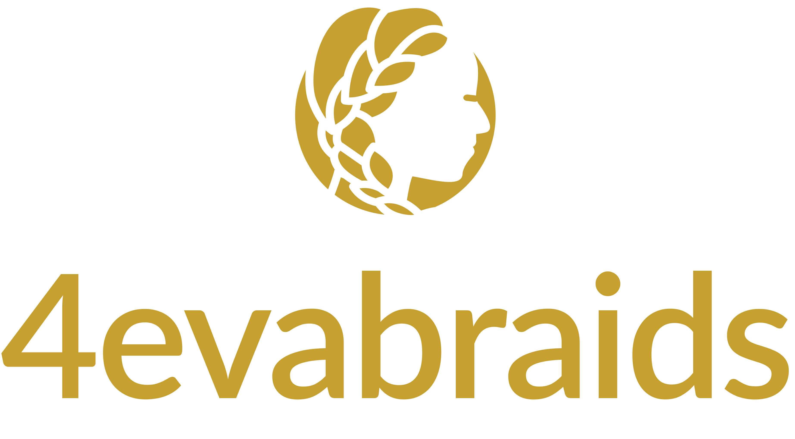

<p align="center">
  <a href="https://4-eva-braids.vercel.app/">
    
  </a>
</p>

<p align="center">
    <em>A hair braiding site</em>
</p>

---
### Live site: [https://4-eva-braids.vercel.app/](https://4-eva-braids.vercel.app/)
#### Online api documentation: [http://api.4evabraids.live/docs](http://api.4evabraids.live/docs)
#### Frontend repository [Frontend on Github](https://github.com/Enielect/4Eva-Braids)
---

## Contents

1. [Introduction](#introduction)
2. [About](#about)
3. [Features (implemented)](#implemented-features)
4. [Features (To be implemented)](#yet-to-be-implemented-features)
5. [Technologies](#technologies)
6. [Folder structure](#folder-structure)
7. [Important Folders and Their Purpose](#important-folders-and-their-purpose)
8. [Algorithms for crucial parts](#algorithms-for-crucial-parts)
9. [Deployment](#deployment)
10. [Contributing](#contributing)
11. [Link to resources](#important-links)

<br>

## Introduction

4EvaBraids is an online hair braiding platform, where users can books appointments with with skilled braiders and get their hair made, either as home service or onsite braiding. While this is the core of it's purpose there are other functionalities and features developed to spice up the site - Read on and see more!

<br>


<br>

## About

-   Purpose
    -   The purpose of this site is to make finding and making braiding appointments easier for clients and also to automate managing custormers for the braiders. It also improves visibility and professionalism.
-   Motivation
    -   Prior tonow, braiders use Instagram and Tiktok as their bassic platform for professional page and work gallery. while these platforms are very good when used as galleries, they have several disadvantages. Just to list a few
        -   Not flexible
        -   Zero Automation
        -   Less professional
        -   Poor data gathering capabilities
-   Solution
    -   We provide the solution to all the above stated problems, and even more. such solutions are stated below
        -   Great professional brand (using a .com site, cool!)
        -   Unlimited way to showcase your work (we even liked the gallery to both IG and Tiktok, so videos hosted there can be displayed nd showcased on the site while keepig our database lighter)
        -   Premuim booking experience
        -   Blog to improve SEO and show Ads
        -   Massive data logging and gathering information
        -   Complex automation to ease both client and braider of stress
<br>


<br>

## Implemented Features
2. Booking algorithm
    - Account is created automatically using booking information xxx (desigm changed, will now redirect to create account)
    - Email is sent to the braiders for a booking appointment
    - SMS is sent to the braiders for a bookig appointment xxx (was not implemented)
    - The whatsapp contack and IG handle of braider is returned to client (To be implemented)
3. Blog
    - Blog with title, body and images (with links to youtube videos if needed)
    - Comments and likes for a blog


## Yet To Be Implemented Features

1. Gallery: A video and photo library
    - Gallery from our local database
    - Gallery from Instagram
    - Gallery from Tiktok
4. Testimonials
    - Testimonials from Clients
    - Achievemens and certificates
5. Online Payment Platform
    - For approved appointments
    - For items bought from the e-store
6. E-Cormmerce
    - An e-store for hair accessories
    - And other fashion components
7. Save every booking request to the database and integrate bookings with google calender
8. Enable users to upload an image of the kind of style they will like to make
9. Users should be able to track their appointment


<br>

## Technologies

The following technologies were used for this project
| Technology | Purpose | Documentation link |
|------------|------------|------------|
| FastAPI | we used Python FastAPI as the web framework | [FastAPI official site](#https://fastapi.tiangolo.com/) |
| Mongodb | The distributed noSQL database for this site is MongoDB Atlas| [MongoDB motor Documentation](https://www.mongodb.com/docs/drivers/motor/) |
| Redis | Redis was used for efficient caching | [Redis](https://redis-py.readthedocs.io/en/stable/)|
| Cloudfare R2 | Our site includes a gallery of images and videos, we used Cloudfare to store these dynamic contents | [Cloudfare storage bucket](https://developers.cloudflare.com/r2/)|
| Pytest | For our robust unit and itegration test | [Pytest](https://docs.pytest.org/en/stable/) |
| NextJS | Easy creation of scalable, fast, SEO friendly react applications | https://nextjs.org/docs |
| Tailwind CSS | Provide a utility first CSS framework, simplifying web applications styling| https://v2.tailwindcss.com/docs |
| Shadcn UI | Streamline development by offering pre-built, themeable components that integrate seamlessly with Tailwind CSS for rapid and consistent UI design. | https://ui.shadcn.com/docs |
| Playwright | Modern end-to-end testing framework designed for reliable automation of web applications across multiple browsers (Chromium, Firefox, and WebKit) | https://playwright.dev/docs/intro |
| Vi test | Fast, modern testing framework for JavaScript and TypeScript, designed to work seamlessly with Vite. It focuses on speed, simplicity, and deep integration with Vite's ecosystem, making testing efficient and developer-friendly. | https://vitest.dev/guide/ |


<br>

## Folder Structure

```txt
.
├── 4eva braids design plan.txt
├── app
│   ├── main.py
│   ├── src
│   │   ├── config
│   │   │   ├── __init__.py
│   │   ├── controllers
│   │   │   └── user
│   │   │       ├── authenticate_user.py
│   │   │       ├── create_access_token.py
│   │   │       ├── create_user.py
│   │   │       ├── delete_user.py
│   │   │       ├── get_all_users.py
│   │   │       ├── get_current_user.py
│   │   │       ├── get_user_by_email.py
│   │   │       ├── get_user_by_id.py
│   │   │       ├── get_user_by_phone_number.py
│   │   │       ├── __init__.py
│   │   │       └── update_user.py
│   │   ├── data
│   │   │   ├── blog.py
│   │   │   ├── __init__.py
│   │   │   └── user.py
│   │   ├── exceptions
│   │   │   ├── already_exists.py
│   │   │   ├── __init__.py
│   │   │   ├── not_found.py
│   │   ├── models
│   │   │   ├── blog.py
│   │   │   ├── comment.py
│   │   │   ├── email.py
│   │   │   ├── __init__.py
│   │   │   ├── token.py
│   │   │   └── user.py
│   │   ├── service
│   │   │   ├── blog.py
│   │   │   ├── __init__.py
│   │   │   └── user.py
│   │   ├── utils
│   │   │   ├── crypt.py
│   │   │   ├── __init__.py
│   │   │   └── send_mail.py
│   │   └── web
│   │       ├── auth.py
│   │       ├── blog.py
│   │       ├── booking.py
│   │       ├── __init__.py
│   │       └── user.py
│   └── tests
│       └── test_user
│           ├── test_user_data.py
│           └── test_user_service.py
├── .coverage
├── .env
├── .envrc
├── folder_tree.txt
```

<br>

## Important Folders and Their Purpose

-   `docs` - This folder contains documentation for the api and the project
-   `tests` - This folder contains a comprehensive test suit for the project
-   `app` - The parent folder for the api
    -   `main.py` - This is the entry point for the project
    -   `src` - Parent folder for all source code
        -   `config` - Configures the api. Has things like database settings etc
        -   `models` - Models for all object in the api are stored here
            -   blog.py - The blog model
            -   comment.py - The comment model
            -   user.py - The user model
        -   `data` - Contains code that interact directly with the DB. It defines an asynchroneous interface for the database. and it does not validate/filter data
            -   user.py - Contains a class that performs all user operation on the database
        -   `service` - The code here runs on top of the `data` folder (it call the methods from there). It performs all the data filtering and routing
            -   user.py - middlemean between the data and the controllers. `controllers` make use of `data` via `service`
        -   `controllers` - This folder is one level below the web interface. it receives from the api routes in `web` and calls the required service
            -   user - This folder contains all the user controllers
                -   create_user.py - This file contains the controller for creating a user
                -   delete_user.py - This file contains the controller for deleting a user
                -   get_all_users.py - This file contains the controller for getting all users
                -   get_user_by_email.py - This file contains the controller for getting a user by email
                -   get_user_by_id.py - This file contains the controller for getting a user by id
                -   get_user_by_phone_number.py - This file contains the controller for getting a user by phone number
                -   update_user.py - This file contains the controller for updating a user
        -   `exceptions` - User defined exceptions used throughout the project
            -   already_exists.py - This file contains the exception for when a user already exists
            -   not_found.py - This file contains the exception for when a user is not found
        -   `utils` - Utility functions used throughout the project
            -   crypt.py - This file contains the functions for encrypting and decrypting data
        -   `web` - Web interface for the api (it defines all routes for handling requests)
            -   user.py - This file contains all the routes for the user

<br>


<br>

## Local Development

1. Clone the repository and `cd` into it

```bash
git clone https://github.com/VicTheM/4EvaBraids-backend.git
cd 4EvaBraids-backend
```

2. Create a `.env` file in the root directory and add the following environment variables

```bash
DB_HOST=your_monogodb_host
DB_PORT=your_mongodb_port
DB_NAME_DEVELOPMENT=your_mongodb_database_name
DB_NAME_TEST=your_mongodb_database_name
DB_NAME_PRODUCTION=your_mongodb_database_name
SECRET_KEY=your_secret_key

# An enviroment variable called ENV will determine which database to use
# The test suit automatically sets this to test. Default is development
```

3. Run the setup script, it does the following
   - setsup python
   - install and starts mongodb
   - install poetry
   - install all dependencies
   - sets up the enviroment
   - create a system service for auto startup

```bash
source setup.sh
```

4. service would be started automatically. Later on, if you want to start or stop the service

```bash
sudo systemctl start 4eva
sudo systemctl stop 4eva
```

Alternatively, if you dont want to use systemctl
```bash
export PYTHONPATH=/home/evabraids/4EvaBraids-backend/app/src
poetry run uvicorn app.main:app --reload
```
note that starting the app directly does not start nginx, so you can access it on ```localhost:8000```

<br>

## Running Tests

To run the tests, run the command below

```bash
poetry run pytest --cov=app
```

## Other details
> [!IMPORTANT]
> - The `/api/bookings/` endpoint will not work if your email and password in the `.env` file is incorrect
> - Futhermore, gmail rejects passwords and uses 2FA instead, so if you want to test this endpoint locally, create a token for your gmail account and use that as the password
> - Steps on creating a token are outlined below
    - Go to 'Google Security settings' when you are logged in
    - Scroll to the bottom and click `search google account`
    - Type `App passwords` in the search bar
    - Type in a name in the field an press `Enter`
    - Copy the generated token and use that as your password in the `.env` file
> - 500 error code occurs when email fails to send

<br>

## Algorithms For Crucial Parts

1. Authentication:
       - The only unauthenticated endpoint is the registration of new users. jwt token was used for authentication
2. Booking Algorithm:
       - When a client books an appointment, the details get sent to the chief braier's email address for follow up
3. Whatsapp & IG:
        - When clients decide to chat via a social app instaed, we keep a count of the number of times either whatsapp or IG is clicked so e can know how many clients were gotten via that means
4. Blog:
       - For now, the blog is a basic writeup with one topic, body and many comments

<br>

## Deployment

We deployed in an Ubuntu 22.04 Jammy virtual machine on Microsoft Azure server <br>
Nginx was used ro reverse proxy `https` request on port `443` to an instance of the running api on port `8000`. <br>
Mongodb runs locally on port `27017` and email client sends mail to port `587` <br>
A system service was written for the api, to start the app automaticaly on power up of the machine.

<br>

## Contributing

Hi, we appreciate any contribution to this repository, kindly fork this repo, add your feature (or fixes) and create a pull request. You can start by implementing the [yet-to-be-implemented](#yet-to-be-implemented-features) above or check for any issue and solve it.

> [!TIP]
> You can also send a mail to us on [victorychibuike121@gmail.com](victorychibuike121@gmail.com)

<br>

## Important Links

1. [Google drive](https://drive.google.com/drive/folders/1nkLk7gpuJ2goUGwwKMx_iF3ZcW3887rJ?usp=sharing)
2. [Project pitch](https://docs.google.com/presentation/d/1FpoadYXboSWbsJNq1_Om3yOAnf_qRi40m4ICDwHJI_4/edit?usp=sharing)
3. [API Documentation](https://drive.google.com/drive/folders/1Vhp2GVdxZdluxA1XQzHLQzimNGElp6V6?usp=sharing)
